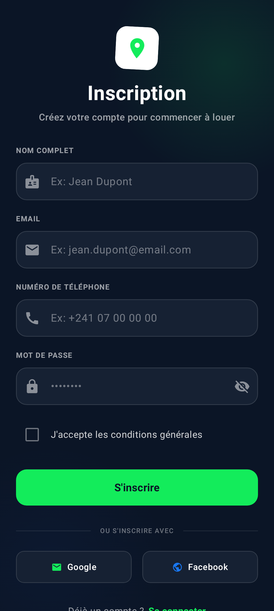
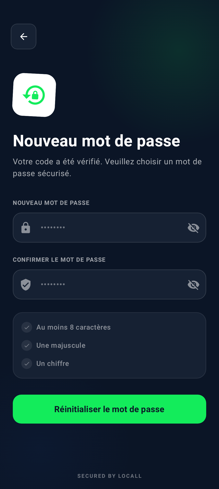
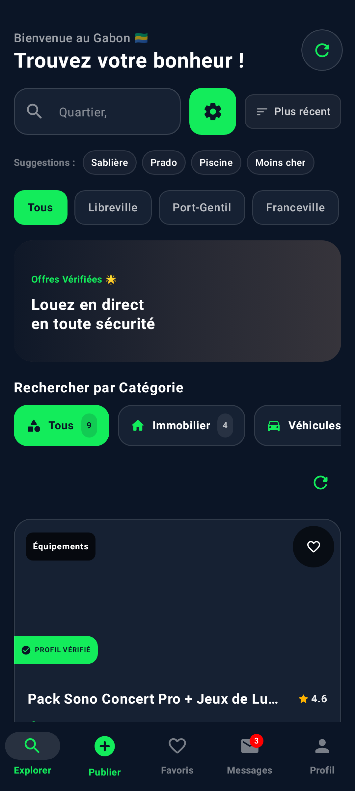
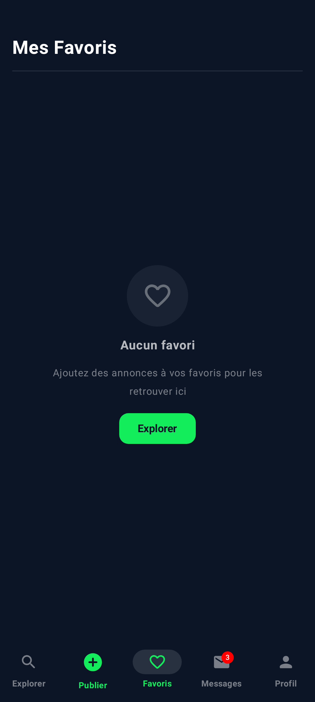
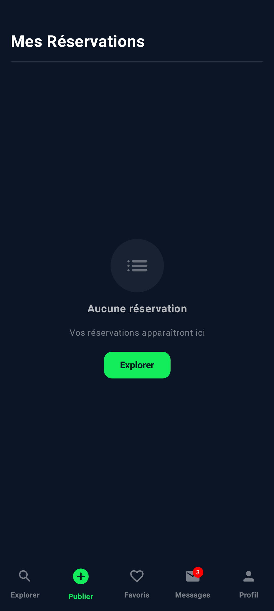
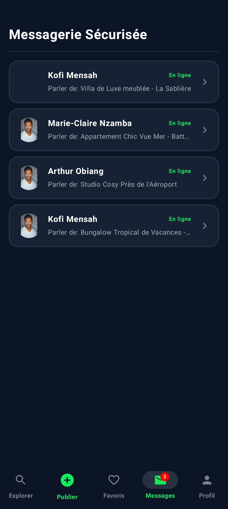
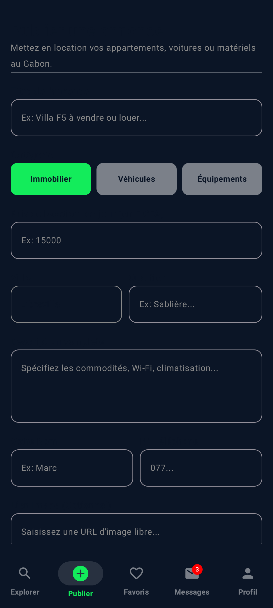
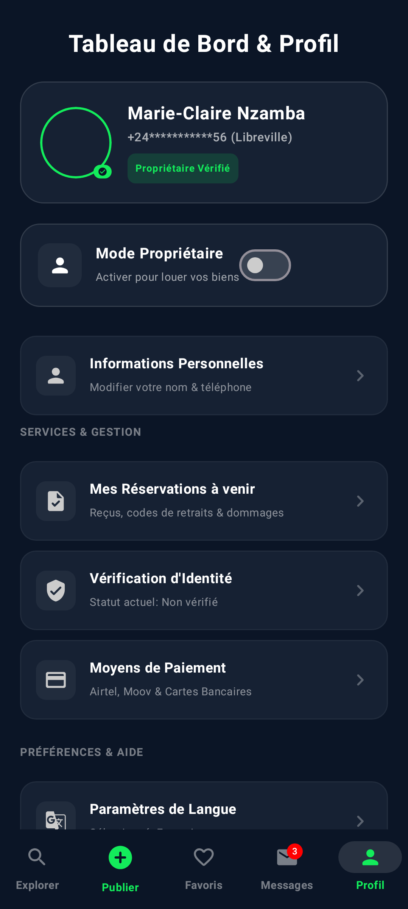

<div align="center">

<h1>LocAll</h1>
<p><strong>Louez tout, partout au Gabon</strong></p>
<p>Application mobile de location entre particuliers — prototype fonctionnel</p>
</div>

---

## Aperçu

LocAll est une application Android de marketplace de location (véhicules, équipements, biens) ciblant le marché gabonais. Elle supporte les paiements via Airtel Money et Moov Money, avec une interface entièrement en français.

**Stack technique :**
- Kotlin + Jetpack Compose (Material 3)
- Room Database (SQLite local)
- MVVM Architecture
- Coil pour le chargement d'images
- Coroutines + Flow

## Captures d'écran

### Authentification
| Connexion | Inscription | Mot de passe oublié |
|:---------:|:-----------:|:-------------------:|
|  |  |  |

| OTP | Nouveau mot de passe |
|:---:|:--------------------:|
|  |  |

### Application principale
| Exploration | Favoris | Réservations |
|:-----------:|:-------:|:------------:|
|  |  |  |

| Messages | Publier une annonce | Profil |
|:--------:|:-------------------:|:------:|
|  |  |  |

## Fonctionnalités

### Authentification
- Connexion / Inscription avec validation de formulaires
- Mot de passe oublié avec OTP (timer + renvoi)
- Indicateur de force du mot de passe
- Acceptation des conditions générales

### Exploration & Recherche
- Grille d'annonces avec skeleton loading
- Pull-to-refresh
- Recherche par texte (quartier, description)
- Filtres par catégorie, ville, prix max
- Tri (prix croissant/décroissant, récent, note)
- Tags populaires cliquables

### Détail d'une annonce
- Galerie d'images (hero banner)
- Récapitulatif de réservation (prix + commission 5%)
- Annonces similaires
- Bouton de partage (intent Android)
- Géolocalisation du bien
- Fiche du propriétaire (note, téléphone masqué)

### Réservation
- Dialog interactif de réservation
- Sélection du nombre de jours
- Choix du mode de paiement (Airtel Money / Moov Money)
- Saisie du numéro de téléphone
- Confirmation PIN
- Annulation avec confirmation

### Messagerie
- Liste des conversations
- Bulles de messages (utilisateur / propriétaire)
- Indicateur de saisie ("écrit...")
- Badge de notifications non lues

### Profil utilisateur
- Édition du profil (nom, téléphone)
- Historique des réservations
-中心 d'aide & support
- Sécurité & langue
- Affichage de la version (v1.0.0 Prototype)

### Espace propriétaire
- Tableau de bord (annonces, revenus, portefeuille)
- Gestion des annonces (actives, en révision, suspendues)
- Édition / Suppression d'annonces
- Calendrier de disponibilités
- Réservations reçues (accepter / refuser avec confirmation)
- Vérification d'identité
- Gestion des litiges

### Design & UX
- Thème dark/light
- Numéros de téléphone masqués
- Skeleton loading
- Empty states réutilisables
- ConfirmDialog pour actions destructives
- Badges de notification
- Accessibilité (contentDescription)

## Installation

### Prérequis
- [Android Studio](https://developer.android.com/studio) (Ladybug ou plus récent)
- JDK 17+
- Android SDK 36

### Étapes

1. Cloner le dépôt :
```bash
git clone https://github.com/Ggboykxz/my-fck-app.git
cd my-fck-app
```

2. Ouvrir le projet dans Android Studio

3. Créer un fichier `.env` à la racine avec votre clé API Gemini :
```
GEMINI_API_KEY=votre_cle_ici
```
Voir `.env.example` pour un exemple.

4. Compiler et installer sur un émulateur ou device physique :
```bash
./gradlew assembleDebug
```

L'APK sera généré dans `app/build/outputs/apk/debug/`.

## Structure du projet

```
app/src/main/java/com/example/
├── data/
│   ├── local/          # Room DB, DAO
│   ├── model/          # Entités (RentalItem, Booking, ChatMessage, UserProfile...)
│   └── repository/     # RentalRepository
├── ui/
│   ├── components/     # Composants réutilisables (SkeletonCard, EmptyState, etc.)
│   ├── screens/        # Écrans (Auth, Dashboard, Profile, Onboarding)
│   ├── theme/          # Couleurs, typographie, thème
│   └── viewmodel/      # RentalViewModel (état + logique)
└── MainActivity.kt
```

## État du projet

> **Prototype fonctionnel** — toutes les données sont simulées (Room DB locale, pas de backend).

### Améliorations récentes
- Validation complète des formulaires
- Skeleton loading & pull-to-refresh
- Tri & filtres avancés
- Annonces similaires
- Annulation de réservation
- Édition de profil
- CRUD propriétaire (modifier/supprimer)
- Confirmation sur actions destructives
- Badge de notifications
- Numéros de téléphone masqués
- Composants réutilisables (22+)

## Licence

Projet privé — prototype de démonstration.
